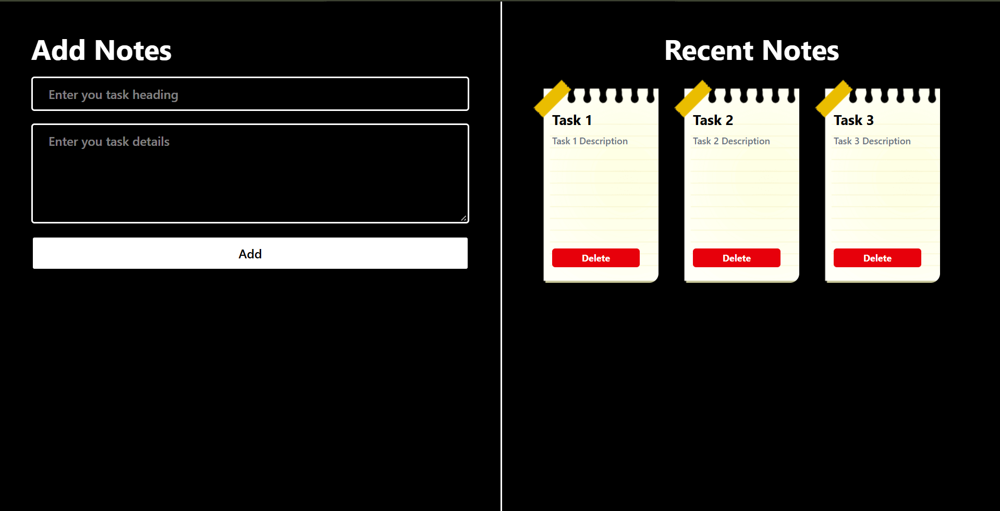

# 📝 Notes App

A simple and user-friendly **Notes App built with React** that allows users to create and manage important upcoming tasks. Each task contains a heading and detailed information, making it easy to keep track of important work.

## 🚀 Features

* ➕ Add new tasks/notes
* 📝 Add a task heading and detailed description
* 💾 Store tasks in browser **LocalStorage**
* 🔄 Retrieve saved tasks after page refresh
* 📱 Responsive user interface
* ⚡ Built with React

## 🛠️ Technologies Used

* **React.js**
* **JavaScript**
* **HTML**
* **CSS / Tailwind CSS**
* **LocalStorage**

## 📂 How It Works

1. Enter a heading for your task.
2. Add the details or description of the task.
3. Add the task.
4. The task is displayed in the recent notes section.
5. Tasks are stored in **LocalStorage**, so they are not lost when the page is refreshed or reopened.

6. ## 📸 Project Preview



## 💻 Getting Started

Clone the repository:

```bash
git clone https://github.com/rksaini23/Notes-App.git
```

Navigate to the project folder:

```bash
cd Notes-App
```

Install dependencies:

```bash
npm install
```

Start the development server:

```bash
npm run dev
```

The application will then be available on the local development server.

## 🎯 Purpose

This project was created to practice and revise **React concepts**, component-based development, state management, event handling, and browser LocalStorage.

## 📌 Future Improvements

* Edit existing notes
* Delete notes
* Mark tasks as completed
* Add task deadlines
* Add search and filtering functionality
* Add categories or priorities

## 👨‍💻 Author

**Rohit**
